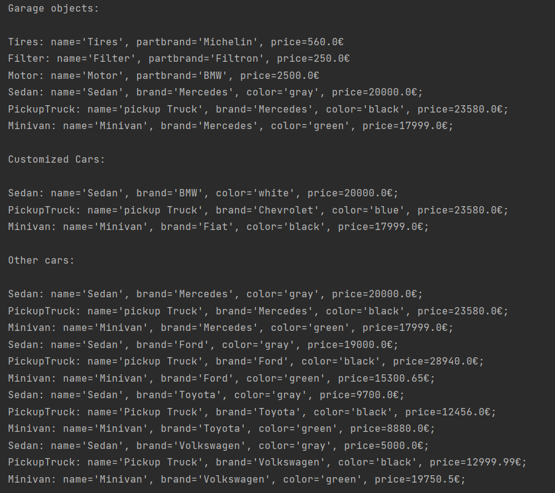

# TMPS
## Topic: Structural Design Patterns
#### Author: Osmătescu Antonina FAF-192
## Objectives
- Study and understand the Structural Design Patterns.
- As a continuation of the previous laboratory work, think about the functionalities that your system will need to provide to the user.
- Implement some additional functionalities using structural design patterns.
## Used Design Patterns
- Adapter
- Decorator
- Facade
## Implementation
In this laboratory work objects of type Cars were used:
*Minivan*, *PickupTruck* and *Sedan*; and objects of type
*AutoParts*:*Filter*, *Motor*, and *Tires*. Type *Cars* and
*AutoParts* contains the same methods: *get*, *set* and 
*toString*. *Cars* contains four attributes, *AutoParts* - three.
<br>The **Adapter Design Pattern** was implemented in *AutoPartsAdapter* calss:
```
public class AutoPartsAdapter extends AdapterUtil {
    private final AutoParts object;
```
This allows to use method *arrangeGarage(Cars... arranges)*
from *Garage* class, with parameters of type *AutoParts*
instead of type *Cars*, which are incompatible types, 
because of different attributes (*Brand* and *PartsBrands*)
```
void arrangeGarage(Cars... arranges){
        System.out.println("\nGarage objects:\n");
        for (Cars cars : arranges)
            System.out.println(cars.toString());
```

<br>The **Decorator Design Pattern** was implemented in 
*BaseFactoryDecorator* class from *Wrappers* package:
```
public class BaseFactoryDecorator implements BaseFactory {
    protected BaseFactory wrapper;
```
With its help was attached a new behavior *Color* from
*ColorCustomizer* class. *ColorCustomizer* allows to
add new function to the factory, instead of creating a 
car with default color it will create a car object with
given color.

<br>The **Facade Design Pattern** was implemented in
*CarsCustomizer* class, where method *getCustomCars()*
allows user to obtain a prefered by him car.
```
public Cars getCustomCars(String type, String customColor, String brand) {
        BaseFactoryDecorator customizer = new ColorCustomizer(carsFactory, customColor);
        Cars customCars = customizer.createCars(type);
        customCars.setBrand(brand);
        return customCars;
```
## Results:
The output is represented below:

